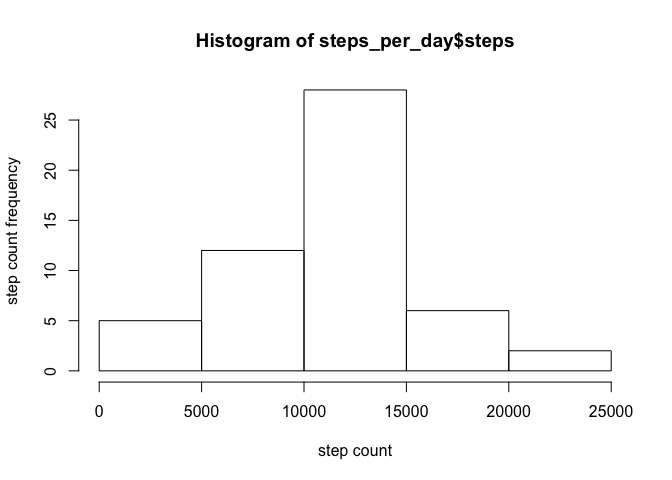
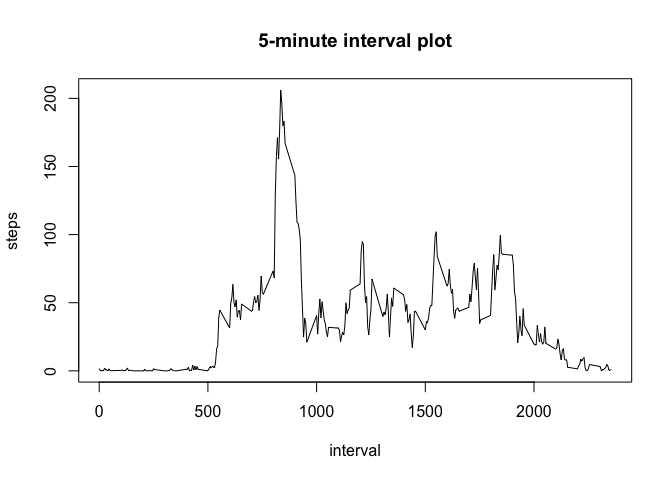
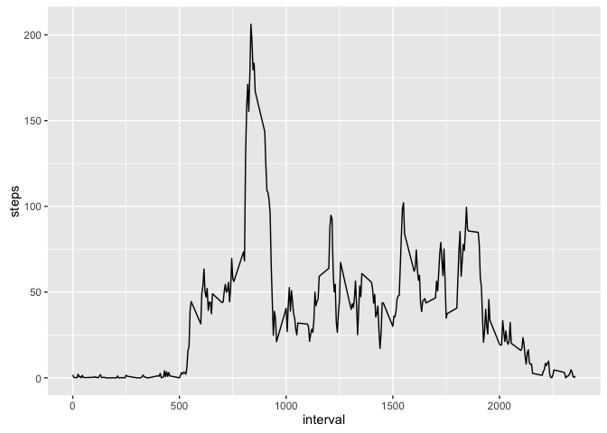

# Reproducible Research: Peer Assessment 1


## Loading and preprocessing the data


```r
library(psych)
```

```
## Warning: package 'psych' was built under R version 3.2.5
```

```r
library(lubridate)
```

```
## Warning: package 'lubridate' was built under R version 3.2.4
```

```
## 
## Attaching package: 'lubridate'
```

```
## The following object is masked from 'package:base':
## 
##     date
```

```r
fileName <- "activity.zip"
unzip(fileName, "activity.csv")
activity <- read.csv("activity.csv", header=TRUE)

steps_per_day <- aggregate(steps~date, data=activity, FUN=sum, na.rm=TRUE)
```

#Average

## What is mean total number of steps taken per day?


```r
hist(steps_per_day$steps, ylab="step count frequency", xlab="step count")
```

<!-- -->

```r
mean_steps<- mean(steps_per_day$steps)
mean_steps
```

```
## [1] 10766.19
```

```r
median_steps<- median(steps_per_day$steps)
median_steps
```

```
## [1] 10765
```

## What is the average daily activity pattern?

```r
avg_steps <- aggregate(steps~interval, data=activity, FUN=mean, na.rm=TRUE)
with(avg_steps, plot(x=interval, y=steps, type="l", main="5-minute interval plot"))
```

<!-- -->
5-minute interval with the maximum number of steps on an average:   

```r
missing_vals <- avg_steps[(which.max(avg_steps$steps)),]$interval
missing_vals
```

```
## [1] 835
```

## Imputing missing values

```r
avg_steps <- aggregate(steps~interval, data=activity, FUN=mean, na.rm=TRUE)
missing_vals <- sum(is.na(activity))
missing_vals
```

```
## [1] 2304
```

```r
for (i in 1:nrow(activity)){
     curstep <- activity$steps[i]
     if(is.na(curstep)){
         for(j in 1:nrow(avg_steps)){
             if(activity$interval[i] == avg_steps$interval[j]){
                 activity$steps[i] = avg_steps$steps[j]
                 break
             }
         }
     }  
 }

head(activity)
```

```
##       steps       date interval
## 1 1.7169811 2012-10-01        0
## 2 0.3396226 2012-10-01        5
## 3 0.1320755 2012-10-01       10
## 4 0.1509434 2012-10-01       15
## 5 0.0754717 2012-10-01       20
## 6 2.0943396 2012-10-01       25
```

### New Plot:  

```r
with(avg_steps, plot(x=interval, y=steps, type="l", main="5-minute interval plot"))
```

<!-- -->

## Are there differences in activity patterns between weekdays and weekends?


```r
new_steps_per_interval <- aggregate(activity$steps, 
                                by = list(interval = as.factor(activity$interval)),
                                FUN=mean, na.rm=TRUE)
                        
new_steps_per_interval$interval <- 
        as.integer(levels(new_steps_per_interval$interval)[new_steps_per_interval$interval])

colnames(new_steps_per_interval) <- c("interval", "steps")
            
library(ggplot2)
```

```
## 
## Attaching package: 'ggplot2'
```

```
## The following objects are masked from 'package:psych':
## 
##     %+%, alpha
```

```r
ggplot(data=new_steps_per_interval, aes(x=interval, y=steps)) + 
    geom_line()
```

<!-- -->


```r
max_interval <- new_steps_per_interval[which.max(new_steps_per_interval$steps),]
max_interval
```

```
##     interval    steps
## 104      835 206.1698
```
